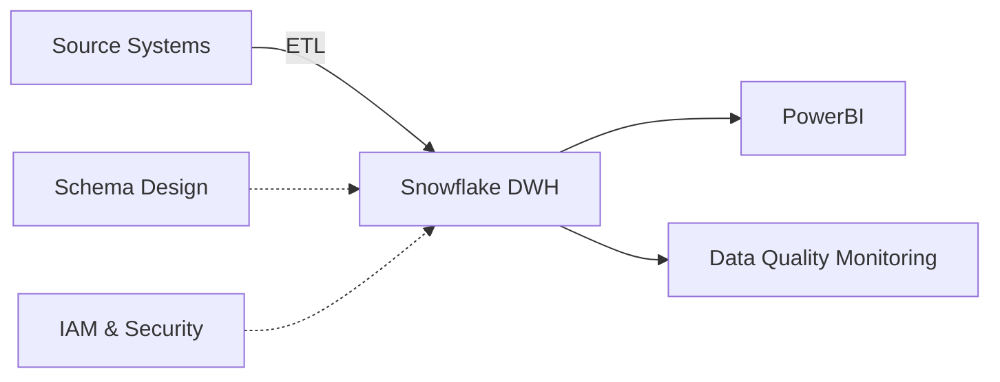
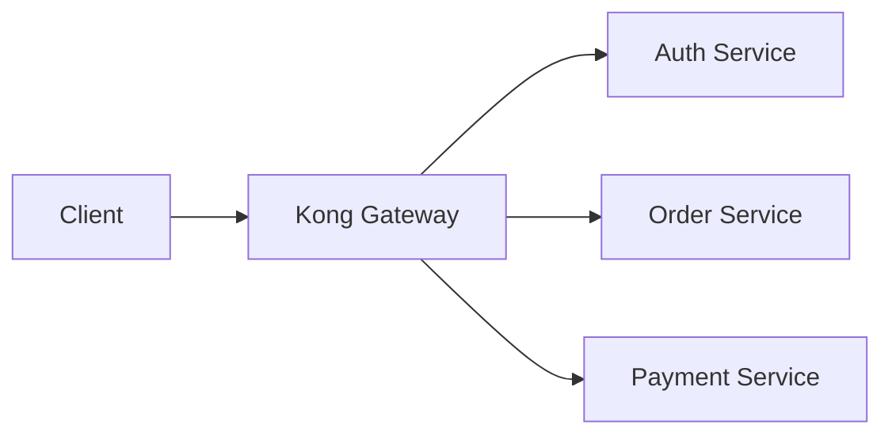

# Create Technical Feature for [Epic]

**Pattern**: Technical Enabler Documentation ⭐⭐⭐⭐ | **Effectiveness**: High | **Use When**: Documenting infrastructure, architecture, or technical work that enables business features

Create a well-structured Agile Technical Feature documentation file (Enabler).

## Purpose

Generate comprehensive Technical Feature (Enabler) documentation that captures architectural decisions, infrastructure changes, refactoring efforts, or technical improvements that enable business features. Technical Features focus on HOW the system works (technical implementation) rather than WHAT users can do (functional capabilities).

**Required Context**:

- `[PARENT_EPIC]`: The Epic this feature supports.
- `[FEATURE_TITLE]`: Name of the technical enabler.
- `[TECHNICAL_GOAL]`: The architectural or infrastructural outcome.
- `[BENEFICIARY]`: Usually developers, system, or future features.

## User Process

1. **Gather Context**: Identify parent Epic, technical goal, and beneficiary (which features/systems benefit)
2. **Invoke Prompt**: Provide Epic context, feature title, and technical objective
3. **Review Generated Feature**: Validate architecture design and implementation plan
4. **Refine Technical Details**: Adjust design diagrams, technology choices, and implementation phases
5. **Technical Review**: Present to architecture team for validation
6. **Commit Documentation**: Save to `docs/agile/features/` with appropriate naming

## Reasoning Process (for AI Agent)

1. **Identify Enabler Goal**: Categorize as architecture, infrastructure, refactoring, performance, security, or compliance work
2. **Define Architecture**: Describe the technical design, patterns, technology stack, and architectural changes
3. **Assess Impact**: Identify which systems, components, or Business Features are affected or enabled
4. **Plan Implementation**: Outline high-level phases (design/spike, implementation, cutover/migration)
5. **Break Down into Tasks**: Identify technical tasks, spikes, or technical stories required
6. **Validate Completeness**: Ensure architecture diagrams, implementation plan, and technical acceptance criteria are clear

## Process

1. **Feature Identifier**:
   - Format: `TECH-[Domain]-[Name]`
   - Example: `TECH-CORE-MIGRATION`

2. **Overview**:
   - Description of technical work.
   - Link to Parent Epic.
   - Supported Business Features (why are we doing this?).

3. **Technical Objectives**:
   - Specific technical outcomes (e.g., "Reduce API latency by 50ms").

4. **Architecture & Design**:
   - Diagrams (Mermaid).
   - Pattern descriptions.
   - Technology stack changes.

5. **Implementation Plan**:
   - Phase 1: Prototype/Spike.
   - Phase 2: Implementation.
   - Phase 3: Cutover.

6. **Dependencies**:
   - Library updates, infrastructure provisioning.

7. **Acceptance Criteria (Technical)**:
   - Performance benchmarks met.
   - Code coverage requirements.
   - Documentation completed.

## Examples (Few-Shot)

### Example 1: Data Warehouse Infrastructure

**Input**:
```
Epic: EPIC-MODERN-REPORTING (Modernize Reporting Infrastructure)
Feature Title: Data Warehouse Setup
Technical Goal: Centralize sales and finance data with sub-second query performance
Beneficiary: Sales Dashboard (FEAT-RPT-SALES-DASH), Finance Dashboard (FEAT-RPT-FINANCE-DASH)
```

**AI Reasoning**:
- Enabler type: Infrastructure (new data warehouse)
- Technical objective: Centralized data store with fast query performance
- Architecture: Snowflake cloud data warehouse, ETL pipelines from source systems
- Supported features: All reporting dashboards depend on this foundation
- Implementation phases: Provision → Schema design → ETL → Testing → Cutover
- Acceptance criteria: Query performance, data accuracy, uptime SLA

**Output**:
```markdown
# Technical Feature: TECH-DATA-WAREHOUSE

## Parent Epic
EPIC-MODERN-REPORTING: Modernize Reporting Infrastructure

## Feature Identifier
TECH-DATA-WAREHOUSE: Data Warehouse Infrastructure Setup

## Overview
Provision and configure Snowflake cloud data warehouse as centralized data repository for all reporting dashboards. This technical enabler provides the foundational data layer required for real-time PowerBI reporting.

**Type**: Infrastructure Enabler
**Supported Business Features**:
- FEAT-RPT-SALES-DASH (Sales Dashboard)
- FEAT-RPT-FINANCE-DASH (Finance Dashboard)
- FEAT-RPT-BOARD-REPORTS (Board Reporting)

## Technical Objectives
- **Primary**: Centralize sales and finance data in single queryable data warehouse
- **Performance**: Achieve sub-second query response time for 95% of dashboard queries
- **Scalability**: Support 5-year historical data (~10TB) with 50+ concurrent users
- **Reliability**: Maintain 99.9% uptime SLA with automated failover

## Architecture & Design

### High-Level Architecture



### Technology Stack
- **Data Warehouse**: Snowflake (X-Large warehouse, multi-cluster auto-scaling)
- **ETL Tool**: Apache Airflow + Snowflake connectors
- **Schema Design**: Star schema with fact and dimension tables
- **Security**: Row-level security, role-based access control
- **Monitoring**: Snowflake query performance monitoring, AWS CloudWatch

### Pattern Descriptions

**Star Schema Design**:
- **Fact Tables**: Sales transactions, financial entries (append-only)
- **Dimension Tables**: Products, customers, regions, dates (slowly changing dimensions Type 2)
- **Aggregation Tables**: Pre-computed daily/monthly rollups for performance

**Data Loading Strategy**:
- **Historical Load**: One-time bulk load of 5 years data (~10TB)
- **Incremental Load**: Nightly delta loads from source systems (changed records only)
- **Real-time Sync**: 5-minute micro-batch updates for sales transactions

### Technology Stack Changes
- **New**: Snowflake cloud data warehouse (replaces legacy on-premise SQL Server)
- **New**: Apache Airflow for ETL orchestration
- **Modified**: PowerBI connectivity (switch to Snowflake connector from SQL Server)
- **Retired**: Legacy Crystal Reports direct database connections

## Implementation Plan

### Phase 1: Provision & Design (3 weeks)
1. **Week 1**: Snowflake account setup, IAM roles configuration
   - Create production and development warehouses
   - Configure role-based access control (RBAC)
   - Setup VPC peering with existing network
2. **Week 2**: Schema design and validation
   - Design star schema (fact and dimension tables)
   - Validate with stakeholders (Finance, Sales, BI team)
   - Document data lineage and transformations
3. **Week 3**: ETL pipeline architecture
   - Design Airflow DAGs for historical and incremental loads
   - Define data quality rules and validation checks

### Phase 2: Implementation (6 weeks)
1. **Weeks 1-2**: Build ETL pipelines
   - Historical bulk load pipeline (source → staging → warehouse)
   - Incremental delta load pipeline (nightly batch)
   - Real-time micro-batch pipeline (5-minute intervals)
2. **Weeks 3-4**: Data migration
   - Execute historical load (10TB of data)
   - Validate data accuracy (100% reconciliation required)
   - Performance tuning (indexing, partitioning, clustering)
3. **Weeks 5-6**: Testing and optimization
   - Load testing with 50+ concurrent users
   - Query performance optimization (<1 second target)
   - Failover and disaster recovery testing

### Phase 3: Cutover (1 week)
1. Switch PowerBI dashboards to Snowflake data source
2. Parallel run with legacy system (1 week validation period)
3. Decommission legacy SQL Server once validated
4. Documentation and knowledge transfer to ops team

## Dependencies

### Infrastructure Dependencies
- Snowflake licensing agreement signed ($50K/year)
- AWS VPC peering setup complete (network team)
- IAM roles and permissions configured (security team)

### Data Dependencies
- Access to source systems (ERP, CRM databases)
- Historical data export from legacy systems (5 years)
- Data dictionary and business rules documentation

### Team Dependencies
- 1 Data Engineer (full-time, 10 weeks)
- 1 DBA (part-time, 4 weeks)
- BI Architect (review and validation, 1 week)

## Acceptance Criteria (Technical)

### Functional Criteria
- [ ] Snowflake warehouse provisioned with X-Large multi-cluster auto-scaling
- [ ] Star schema implemented with all required fact and dimension tables
- [ ] ETL pipelines operational (historical, incremental, real-time)
- [ ] 5-year historical data loaded with 100% accuracy (reconciled against source)
- [ ] Row-level security enforced (regional sales data isolation)

### Performance Criteria
- [ ] Query performance: 95% of queries complete in <1 second
- [ ] Data freshness: Real-time pipeline delivers data within 5 minutes
- [ ] Concurrent users: Support 50+ simultaneous PowerBI connections
- [ ] ETL performance: Nightly incremental load completes in <1 hour

### Reliability Criteria
- [ ] Uptime: 99.9% availability during business hours (SLA)
- [ ] Disaster recovery: Automated failover tested and validated
- [ ] Monitoring: Query performance dashboards operational
- [ ] Data quality: Validation checks running on all pipelines (100% pass rate)

### Documentation Criteria
- [ ] Architecture diagrams complete (high-level and detailed)
- [ ] ETL pipeline documentation with data lineage
- [ ] Runbooks for common operations (backup, restore, scaling)
- [ ] Knowledge transfer session completed with ops team

## Success Metrics
- **Query Performance**: 95%+ of dashboard queries complete in <1 second
- **Data Freshness**: 5-minute lag from source to warehouse
- **Cost Efficiency**: $50K/year Snowflake cost vs $100K/year legacy infrastructure (50% savings)
- **Reliability**: 99.9% uptime achieved over first 90 days
```

### Example 2: API Migration (Quick Example)

**Input**:
```
Epic: Microservices Migration. Feature: REST API Gateway. Goal: Centralize API routing.
```

**AI Reasoning**:
- Enabler type: Architecture (API gateway introduction)
- Technical objective: Centralized routing, authentication, rate limiting
- Supported features: All microservices benefit from centralized API management
- Implementation: Provision Kong Gateway, migrate routes, cutover

**Output**:
```markdown
# Technical Feature: TECH-API-GATEWAY

## Overview
Introduce Kong API Gateway as centralized routing, authentication, and rate limiting layer for all microservices.

## Technical Objectives
- Centralize API routing from monolith to microservices
- Implement JWT authentication and rate limiting
- Achieve <10ms added latency

## Architecture & Design


## Implementation Plan
1. **Phase 1**: Provision Kong Gateway, configure routes
2. **Phase 2**: Migrate authentication to JWT
3. **Phase 3**: Cutover traffic from monolith

## Acceptance Criteria
- [ ] All microservices routed through Kong
- [ ] JWT authentication operational
- [ ] <10ms added latency measured
- [ ] Rate limiting enforced (1000 req/min per client)
```

## Expected Output

**Deliverables**:

1. Complete Technical Feature markdown file.
2. Implementation roadmap.

**Format**: Markdown file following `docs/agile/features/` structure.

## Quality Criteria

- [ ] Clear technical objective with measurable outcomes
- [ ] Linked to supported Business Features or Epic with ID references
- [ ] Architecture diagrams (Mermaid) or detailed descriptions included
- [ ] Technology stack and pattern descriptions specified
- [ ] Implementation plan with phases and timeline
- [ ] Dependencies identified (infrastructure, data, team)
- [ ] Technical acceptance criteria (functional, performance, reliability, documentation)
- [ ] Clear "Definition of Done" for the enabler
- [ ] Success metrics defined (performance, cost, reliability)
- [ ] Document saved to `docs/agile/features/` folder

---

**Related Prompts**:
- `create-epic.prompt.md` - Create parent Epic documentation
- `create-business-feature.prompt.md` - Create Business Features that this enables
- `create-user-story.prompt.md` - Break down into technical tasks/stories

**Related Rules**:
- `.cursor/rules/agile/technical-feature-documentation-rule.mdc`
- `.cursor/rules/agile/epic-documentation-rule.mdc`
- `.cursor/rules/agile/business-feature-documentation-rule.mdc`

---

**Provenance**: Created 2025-12-08 | Updated 2025-12-08 (PROMPTS-OPTIMIZE) | Pattern: Technical Enabler Documentation
