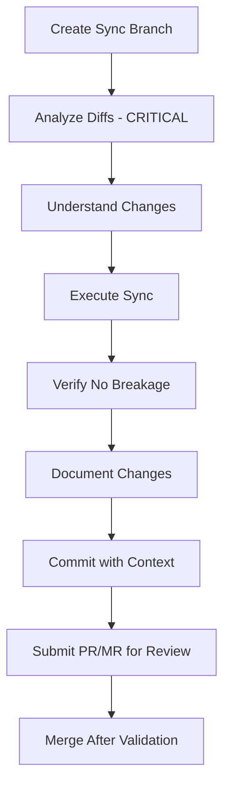

# Sync Improvements Across Repositories

Please analyze and sync improvements made to rules, prompts, and other artifacts from one repository to others, propagating best practices and new insights while respecting repository-specific differences.

**Pattern**: Cross-Repository Synchronization Pattern ⭐⭐⭐⭐⭐
**Effectiveness**: Essential for maintaining consistency across multiple repos
**Use When**: Monthly sync, after major improvements, or quarterly audits

---

## Purpose

When working across multiple repositories (e.g., `eneve.domain`, `eneve.ebase.foundation`, `eneve.ebase.datamigrator`):
- Improvements made in one repo should benefit others
- New rules/prompts should be shared
- Best practices should propagate
- **BUT**: Blind copying is dangerous - must understand changes

This prompt enables intelligent, **analysis-driven** synchronization.

## Supported Artifact Types

- **Rules** (`.cursor/rules/**/*.mdc`)
- **Prompts** (`.cursor/prompts/**/*.prompt.md`)
- **Scripts** (`scripts/**/*.{ps1,sh,py}`)
- **Configuration** (`.editorconfig`, `.gitignore`, etc.)
- **Documentation** (`docs/**/*.md`)

## Expected Output

1. **Diff analysis** showing what changed between repos
2. **Sync recommendations** (which changes to pull, which to skip)
3. **Conflict resolution** for incompatible differences
4. **Merged artifacts** ready for review

## Critical Principle

> **⚠️ NEVER BLIND COPY**
>
> Always analyze diffs, understand changes, and decide what should sync.
> Context matters. Repository-specific customizations are valid.

## Reasoning Process

Before syncing:
1. **Identify differences**: What changed between repos?
2. **Understand why**: What problem does the change solve?
3. **Assess applicability**: Does this change benefit target repo?
4. **Check conflicts**: Does this contradict target repo's setup?
5. **Determine action**: Pull, skip, adapt, or merge?

## Process

### Step 1: Analyze Source and Target

**Identify repositories**:
- **Source Repo**: Where improvements were made (e.g., `eneve.ebase.datamigrator`)
- **Target Repo**: Where to sync improvements (e.g., `eneve.domain`)

**Compare artifact inventories**:
```bash
# List rules/prompts in each repo
ls -R .cursor/rules/ > source-inventory.txt
ls -R .cursor/rules/ > target-inventory.txt
diff source-inventory.txt target-inventory.txt
```

**Categorize differences**:
- [ ] New artifacts in source (not in target)
- [ ] Modified artifacts (exist in both, content differs)
- [ ] Deleted artifacts (in target, not in source)
- [ ] Repository-specific artifacts (intentionally different)

### Step 2: Perform Diff Analysis

For each artifact that exists in both repos:

**Compare versions**:
```bash
# Example: Compare same rule in two repos
diff eneve.domain/.cursor/rules/ticket/plan-rule.mdc \
     eneve.ebase.datamigrator/.cursor/rules/ticket/plan-rule.mdc
```

**Analyze differences**:

**Type 1: Clear Improvement** ✅
- Bug fix in source
- Better examples added
- Improved clarity
- New validation checklist items
- **Action**: Pull into target

**Type 2: Repository-Specific Customization** ⚠️
- Different project structure references
- Different tool configurations
- Different team workflows
- **Action**: Skip (intentional difference)

**Type 3: Conflicting Changes** ❌
- Both repos improved same section differently
- Incompatible approaches
- Different philosophies
- **Action**: Merge manually or choose better version

**Type 4: Regression** ⛔
- Source version worse than target
- Missing important content
- Lower quality
- **Action**: Skip (keep target version)

### Step 3: Prioritize Sync Candidates

**High Priority** (sync immediately):
- Critical bug fixes
- Security improvements
- Major quality enhancements
- New best practices

**Medium Priority** (sync when convenient):
- Clarity improvements
- Additional examples
- Better organization
- Enhanced documentation

**Low Priority** (evaluate carefully):
- Minor wording changes
- Stylistic preferences
- Formatting differences
- Subjective improvements

**No Sync** (repository-specific):
- Project-specific references
- Tool-specific configurations
- Team-specific workflows
- Intentional customizations

### Step 4: Create Sync Plan

For each sync candidate:

**Document the change**:
```markdown
## Sync Item: [Artifact Name]

### Change Summary
**Source**: [source-repo] - [version/date]
**Target**: [target-repo] - [version/date]
**Change Type**: [New | Modified | Deleted]

### Diff Preview
```diff
- Old content
+ New content
```

### Analysis
**What Changed**: [Description]
**Why Changed**: [Reason/problem solved]
**Benefit**: [Why target repo should adopt this]
**Risk**: [Potential issues]

### Recommendation
**Action**: [Pull | Skip | Adapt | Merge]
**Rationale**: [Why this action]

### Implementation
[Specific steps to sync this artifact]
```

### Step 5: Execute Sync

**Sync Workflow** (following `rule.rule-authoring.rule-sync.v1`):



**Step-by-Step**:

1. **Create Sync Branch**:
   ```bash
   cd [target-repo]
   git checkout -b sync/improvements-from-[source-repo]-[date]
   ```

2. **Analyze and Diff** (CRITICAL - NO BLIND COPIES):
   - Compare source and target artifacts
   - Identify what changed and WHY
   - Understand each change's purpose
   - Flag anything unclear for manual review

3. **Execute Sync**:
   ```bash
   # For new artifacts (after analysis)
   cp [source-repo]/.cursor/rules/new-rule.mdc \
      [target-repo]/.cursor/rules/new-rule.mdc

   # For modified artifacts (after merge/adaptation)
   # Use merge tool or manual edit
   code --diff [source-file] [target-file]
   ```

4. **Adapt Repository-Specific Elements**:
   - Update project references
   - Adjust tool configurations
   - Modify examples for target repo context
   - Update cross-references

5. **Verify No Breakage**:
   - [ ] All references resolve
   - [ ] Cross-references work
   - [ ] No conflicts with existing rules
   - [ ] Linting passes
   - [ ] Documentation builds

6. **Document Changes**:
   ```markdown
   # sync-log.md

   ## Sync from [source-repo] on [date]

   ### Artifacts Synced
   1. **[artifact-name]**: [reason]
   2. **[artifact-name]**: [reason]

   ### Adaptations Made
   - [Adaptation 1]
   - [Adaptation 2]

   ### Artifacts Skipped
   1. **[artifact-name]**: [reason for skipping]
   ```

7. **Commit with Context**:
   ```bash
   git add .
   git commit -m "Sync improvements from [source-repo]

   Synced artifacts:
   - [artifact-1]: [reason]
   - [artifact-2]: [reason]

   Analysis performed on all diffs - no blind copies.
   Repository-specific elements adapted.
   All cross-references verified.

   Source: [source-repo] @ [commit-hash]
   Sync Date: [date]"
   ```

8. **Submit PR/MR for Review**:
   - Create pull/merge request
   - Link to source repo changes
   - Explain sync rationale
   - Highlight adaptations made

9. **Merge After Validation**:
   - Team reviews sync
   - Validates changes make sense
   - Approves and merges

### Step 6: Verify Sync Success

After merging:
- [ ] All synced artifacts present
- [ ] No broken links introduced
- [ ] Repository-specific elements intact
- [ ] Documentation updated
- [ ] Team aware of changes
- [ ] Sync logged for future reference

## Output Format

```markdown
## Sync Analysis Report

### Sync Overview
**Source Repository**: [path/URL]
**Target Repository**: [path/URL]
**Analysis Date**: [date]
**Artifact Type**: [rules/prompts/scripts/docs]

---

## New Artifacts in Source

### 1. [New Artifact Name]
**Path**: [path in source repo]
**Created**: [date]
**Purpose**: [what it does]

**Recommendation**: PULL ✅
**Rationale**: [Why target repo would benefit]

**Implementation**:
```bash
cp [source-path] [target-path]
# Then adapt: [adaptations needed]
```

---

## Modified Artifacts

### 1. [Modified Artifact Name]
**Source Version**: [version/date]
**Target Version**: [version/date]

**Diff Analysis**:
```diff
- Old approach
+ Improved approach
```

**Change Summary**:
- [Change 1]: [Description]
- [Change 2]: [Description]

**Why Changed**: [Problem solved or improvement made]

**Recommendation**: PULL ✅
**Rationale**:
- ✅ Clear improvement
- ✅ No conflicts with target repo
- ✅ Applicable to target repo's context

**Adaptations Needed**:
- Update project references: [specific changes]
- Adjust examples: [how to adjust]

---

### 2. [Another Modified Artifact]
**Diff Analysis**:
```diff
Repository-specific customization in source
```

**Recommendation**: SKIP ⚠️
**Rationale**:
- ⚠️ Source change is repository-specific
- ⚠️ Target repo has valid customization
- ⚠️ Not applicable to target context

**Action**: Keep target version as-is

---

### 3. [Conflicting Changes Artifact]
**Diff Analysis**:
```diff
- Target has approach A
+ Source has approach B
```

**Recommendation**: MERGE MANUALLY 🔀
**Rationale**:
- Both repos improved same section
- Both have valuable elements
- Need to combine best of both

**Merge Strategy**:
1. Take source's [element X]
2. Keep target's [element Y]
3. Combine into new version

**Merged Version**:
```markdown
[Proposed merged content]
```

---

## Deleted Artifacts in Source

### 1. [Deleted Artifact]
**Status**: Present in target, absent in source
**Last Modified in Source**: [date] (before deletion)

**Analysis**: [Why was it deleted in source?]
- Superseded by [replacement]?
- Deemed obsolete?
- Moved to different location?

**Recommendation**: INVESTIGATE 🔍
**Action**:
- Check source repo's git history
- Determine if target should also delete/archive
- Or if deletion was source-specific

---

## Sync Recommendations Summary

### High Priority Sync
**Count**: [count]
1. [Artifact 1] - [Reason]
2. [Artifact 2] - [Reason]

### Medium Priority Sync
**Count**: [count]
1. [Artifact 3] - [Reason]

### Skip (Repository-Specific)
**Count**: [count]
1. [Artifact 4] - [Reason]

### Conflicts Requiring Manual Merge
**Count**: [count]
1. [Artifact 5] - [Merge strategy]

---

## Sync Plan

### Phase 1: New Artifacts
**Artifacts**: [count]
**Estimated Time**: [hours]
**Risk**: Low

1. Copy new artifact X
2. Adapt for target repo
3. Update cross-references
4. Test

### Phase 2: Clear Improvements
**Artifacts**: [count]
**Estimated Time**: [hours]
**Risk**: Low

1. Merge improved versions
2. Adapt repository-specific elements
3. Verify no breakage

### Phase 3: Manual Merges
**Artifacts**: [count]
**Estimated Time**: [hours]
**Risk**: Medium

1. Review both versions
2. Create merged version
3. Peer review
4. Test thoroughly

---

## Sync Execution Log

[Generated after executing sync]

### Branch Created
**Branch**: `sync/improvements-from-[source]-[date]`
**Created**: [timestamp]

### Artifacts Synced
1. ✅ **[artifact-1]**: Pulled from source
   - Adapted: [adaptations]
   - Verified: [verifications]

2. ✅ **[artifact-2]**: Merged conflict
   - Source element: [X]
   - Target element: [Y]
   - Combined: [Z]

3. ⏭️ **[artifact-3]**: Skipped (repository-specific)
   - Reason: [explanation]

### Verification Results
- [ ] All references resolve ✅
- [ ] Cross-references updated ✅
- [ ] Linting passes ✅
- [ ] No conflicts ✅

### Commit Details
**Commit Hash**: [hash]
**Message**: [commit message]

### PR/MR Created
**PR Number**: #[number]
**Link**: [URL]
**Status**: [Open | Merged]

---

## Analysis and Diff Checklist

**CRITICAL**: Verify NO blind copies performed

- [ ] All diffs analyzed manually
- [ ] Change rationale understood for each artifact
- [ ] Repository-specific elements identified
- [ ] Conflicts resolved appropriately
- [ ] Adaptations documented
- [ ] Team reviewed sync plan
- [ ] No information lost
- [ ] No breaking changes introduced
```

## Examples (Few-Shot)

### Example 1: Sync Clear Improvement

**Input**: Compare `rule-sync-rule.mdc` between `datamigrator` and `eneve.domain`

**Reasoning**:
- Datamigrator has 8-step workflow with critical "Analyze and Diff" step
- Eneve.domain has 5-step workflow missing critical analysis
- Datamigrator version prevents blind copying (better safeguards)
- Should pull datamigrator improvements into eneve.domain

**Output**:
```markdown
## Sync Item: rule-sync-rule.mdc

### Diff Analysis
**Source** (datamigrator): 8 steps with "Analyze and Diff (CRITICAL)"
**Target** (eneve.domain): 5 steps, missing analysis step

**Key Differences**:
+ Step 1: Create Sync Branch (new)
+ Step 3: Analyze and Diff - CRITICAL (new)
+ Step 8: Merge Branch (new)
+ Checklist: "Analysis and Diff performed - NO blind copies" (new)

### Recommendation: PULL ✅

**Rationale**:
- Prevents blind copying (critical safeguard)
- Enforces analysis before sync
- Adds branch workflow for PR/MR review
- Improves quality and safety

**Implementation**:
1. Update Step 4 in eneve.domain to include all 8 steps
2. Add "Analyze and Diff" as Step 3
3. Add checklist item for analysis verification
4. Keep eneve.domain-specific examples
```

### Example 2: Skip Repository-Specific Customization

**Input**: Compare `project-setup-rule.mdc` between repos

**Reasoning**:
- Source references specific CI/CD provider (Azure DevOps)
- Target references different CI/CD provider (GitHub Actions)
- Both are valid for their contexts
- Should skip (intentional difference)

**Output**:
```markdown
## Sync Item: project-setup-rule.mdc

### Diff Analysis
**Source**: References Azure DevOps pipelines
**Target**: References GitHub Actions workflows

### Recommendation: SKIP ⚠️

**Rationale**:
- Repository-specific CI/CD configuration
- Both approaches valid for their contexts
- Not a quality difference, just different tooling
- Intentional customization should be preserved

**Action**: Keep target version unchanged
```

### Example 3: Merge Conflicting Improvements

**Input**: Compare `validation-before-completion-rule.mdc`

**Reasoning**:
- Source added "Documentation Quality" section
- Target added "Test Coverage" section
- Both improvements are valuable
- Should merge both into target

**Output**:
```markdown
## Sync Item: validation-before-completion-rule.mdc

### Diff Analysis
**Source**: Added "Documentation Quality" validation
**Target**: Added "Test Coverage" validation
**Conflict**: Both added new sections independently

### Recommendation: MERGE MANUALLY 🔀

**Merge Strategy**:
1. Keep target's "Test Coverage" section
2. Add source's "Documentation Quality" section
3. Maintain consistent structure

**Merged Version**:
```markdown
## Quality Validation

### Test Coverage
[From target version]

### Documentation Quality
[From source version]
```

**Result**: Target gets both improvements
```

## Sync Frequency Recommendations

### Continuous (As Changes Occur)
- **Critical bug fixes**: Sync immediately
- **Security improvements**: Sync immediately
- **Breaking changes**: Coordinate across repos

### Monthly
- **New rules/prompts**: Review and sync valuable additions
- **Significant improvements**: Pull quality enhancements
- **Framework evolution**: Keep repos aligned

### Quarterly
- **Comprehensive audit**: Full diff analysis across all artifacts
- **Consolidation**: Remove divergent duplicates
- **Standardization**: Align common patterns

### Annual
- **Strategic alignment**: Review architectural differences
- **Template refresh**: Update shared templars/exemplars
- **Lessons learned**: Propagate accumulated insights

## Troubleshooting

### Issue: Can't Determine Which Version is Better

**Symptom**: Source and target both have improvements, unclear which is best

**Solution**:
1. List specific improvements in each
2. Score each on: completeness, clarity, examples, accuracy
3. Merge best elements from both
4. Get peer review if still uncertain

### Issue: Too Many Differences to Analyze

**Symptom**: Repos diverged significantly, 100+ diffs

**Solution**:
- Start with high-impact artifacts (frequently used)
- Sync in batches (10-20 artifacts at a time)
- Focus on critical improvements first
- Accept some divergence is OK

### Issue: Sync Breaks Target Repo

**Symptom**: After sync, target repo has issues (broken links, conflicts)

**Solution**:
- This is why we use branches and PRs!
- Revert sync branch
- Identify what broke
- Adapt more carefully
- Re-attempt with better adaptations

### Issue: Unclear if Difference is Intentional

**Symptom**: Repos differ but can't tell if customization or divergence

**Solution**:
1. Check git history for context
2. Ask teams: "Why does X differ between repos?"
3. Document intentional differences
4. Add comment in file explaining customization

## Anti-Patterns

### ❌ Blind Copy Everything

**Bad**: `cp -r source/.cursor/rules/* target/.cursor/rules/`

**Impact**: Overwrites target-specific customizations, breaks references

**Better**: Analyze diffs, understand changes, adapt appropriately

### ❌ Never Sync

**Bad**: "Our repo is different, we won't sync anything"

**Impact**: Miss bug fixes and improvements, repos diverge completely

**Better**: Regular sync cadence with analysis

### ❌ Sync Without Testing

**Bad**: Sync changes and commit immediately without verification

**Impact**: Break target repo, introduce conflicts

**Better**: Use branches, verify, test, then PR/MR

### ❌ Lose Repository-Specific Elements

**Bad**: Overwrite target's customizations during sync

**Impact**: Lose valuable context-specific improvements

**Better**: Preserve customizations, only sync universally applicable changes

## Quality Checklist

Before completing sync:

- [ ] All diffs analyzed (NO blind copies)
- [ ] Change rationale understood
- [ ] Applicability to target repo verified
- [ ] Repository-specific elements identified and preserved
- [ ] Conflicts resolved appropriately
- [ ] New artifacts adapted for target context
- [ ] Cross-references updated
- [ ] All links resolve correctly
- [ ] Linting passes
- [ ] Documentation updated
- [ ] Changes committed with context
- [ ] PR/MR created for review
- [ ] Team aware of sync

## Best Practices

### DO
- ✅ Analyze every diff before syncing
- ✅ Understand WHY changes were made
- ✅ Adapt repository-specific elements
- ✅ Use branches and PRs for sync
- ✅ Document what was synced and why
- ✅ Verify no breakage after sync
- ✅ Regular sync cadence (monthly/quarterly)

### DON'T
- ❌ Blind copy without analysis
- ❌ Overwrite customizations
- ❌ Sync without testing
- ❌ Ignore conflicts
- ❌ Sync untested improvements
- ❌ Skip documentation of changes
- ❌ Merge without team review

---

## Related Prompts

- `housekeeping/consolidate-duplicates.prompt.md` - After sync, consolidate any new duplicates
- `housekeeping/update-cross-references.prompt.md` - Fix references after sync
- `housekeeping/extract-templar-exemplar.prompt.md` - Extract patterns found during sync

---

## Related Rules

- `.cursor/rules/rule-authoring/rule-sync-rule.mdc` - Detailed sync workflow

## Usage

**Compare two repositories**:
```
@sync-improvements \
  --source /path/to/eneve.ebase.datamigrator \
  --target /path/to/eneve.domain
```

**Sync specific artifact type**:
```
@sync-improvements \
  --source eneve.ebase.datamigrator \
  --target eneve.domain \
  --type rules
```

**Dry run (analysis only)**:
```
@sync-improvements \
  --source eneve.ebase.datamigrator \
  --target eneve.domain \
  --dry-run
```

**Sync specific artifact**:
```
@sync-improvements \
  --source datamigrator/.cursor/rules/ticket/plan-rule.mdc \
  --target eneve.domain/.cursor/rules/ticket/plan-rule.mdc
```

## Script
- `.cursor/scripts/housekeeping/sync-improvements.ps1`
  - Console summary: `pwsh -File .cursor/scripts/housekeeping/sync-improvements.ps1 -SourceRoot "E:/path/source" -TargetRoot "E:/path/target"`
  - JSON: `pwsh -File .cursor/scripts/housekeeping/sync-improvements.ps1 -SourceRoot "E:/path/source" -TargetRoot "E:/path/target" -Json`
  - PassThru object: `pwsh -File .cursor/scripts/housekeeping/sync-improvements.ps1 -SourceRoot "E:/path/source" -TargetRoot "E:/path/target" -PassThru`

---

**Note**: **CRITICAL**: Always analyze diffs and understand changes. NO blind copying. Repository context matters.

---

**Created**: 2025-12-06
**Follows**: `.cursor/rules/prompts/prompt-creation-rule.mdc` v1.0.0
**Improved**: 2025-12-08 (PROMPTS-OPTIMIZE ticket)
