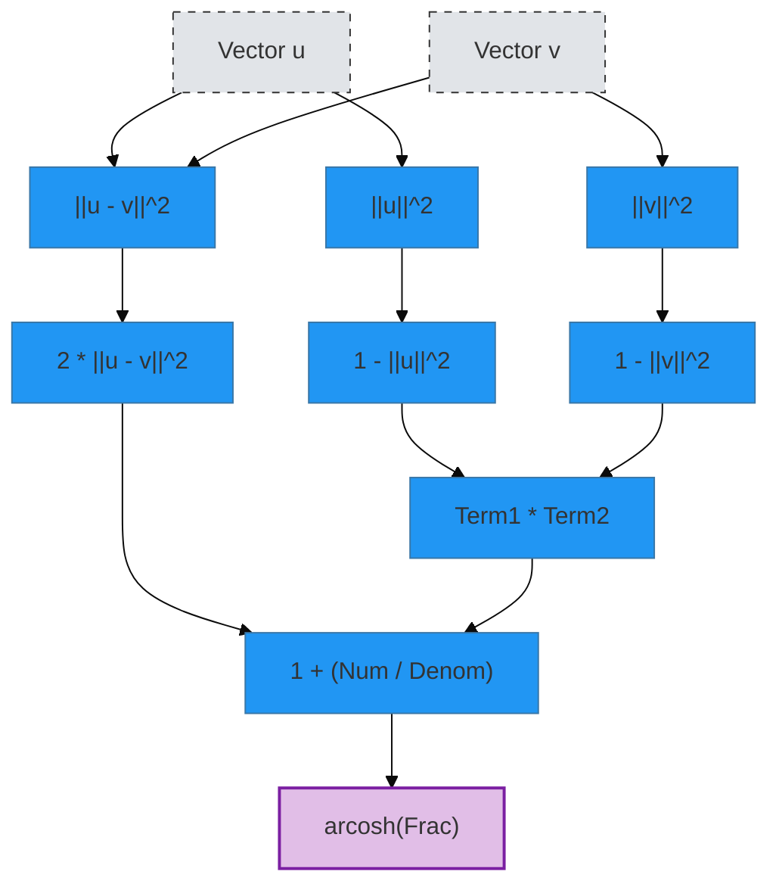

# The Topology of Intelligence

> **Source:** Video Analysis (ID: D8GOeCFFby4)
> **Relevance:** Theoretical Validation of the Ternary VAE Project.

## Core Thesis

**Intelligence is not symbolic manipulation; it is the construction of a high-dimensional geometric map.**

<!-- embed: DOCUMENTATION/06_DIAGRAMS/02_SCIENTIFIC_THEORY/geometry/poincare_distance.mmd -->

1.  **Logic is Topology:**

    - The logical statement "A Penguin is a Bird" is not a string of text.
    - Geometrically, it is the _embedding_ of the "Penguin" manifold inside the "Bird" manifold.
    - _Connection to Project:_ This matches our 3-adic set construction. The set of codons encoding `Alanine` is geometrically nested within the set of `Hydrophobic` amino acids.

2.  **Grokking = Phase Transition to Geometry:**

    - "Grokking" (sudden generalization) occurs when a neural network shifts from memorizing data points to discovering the underlying _manifold_.
    - _Connection to Project:_ Our "Pareto Frontier" analysis showed a tradeoff between `distance_correlation` and `hierarchy`. This frontier _is_ the shape of the manifold being learned.

3.  **Neuroscience Convergence (Grid Cells):**
    - The brain uses "Grid Cells" not just for spatial navigation, but for _conceptual_ navigation.
    - Abstract knowledge is stored as coordinates in a mental space.
    - _Connection to Project:_ Our "Regenerative Axis" in the latent space is essentially a coordinate system for the "Concept of Autoimmunity".

## Actionable Insights for the Project

- **Reframing the Narrative:** We are not just "predicting mutations". We are **reverse-engineering the Grid Cells of Evolution**. The virus moves through this space, and we are tracking its coordinates.
- **New Metric:** "Topological Nesting Score". We should measure how well our model preserves the nesting of biological categories (e.g., Serotype A inside Influenza Family).
