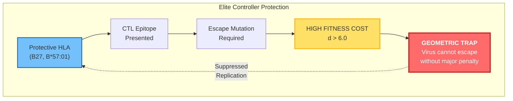
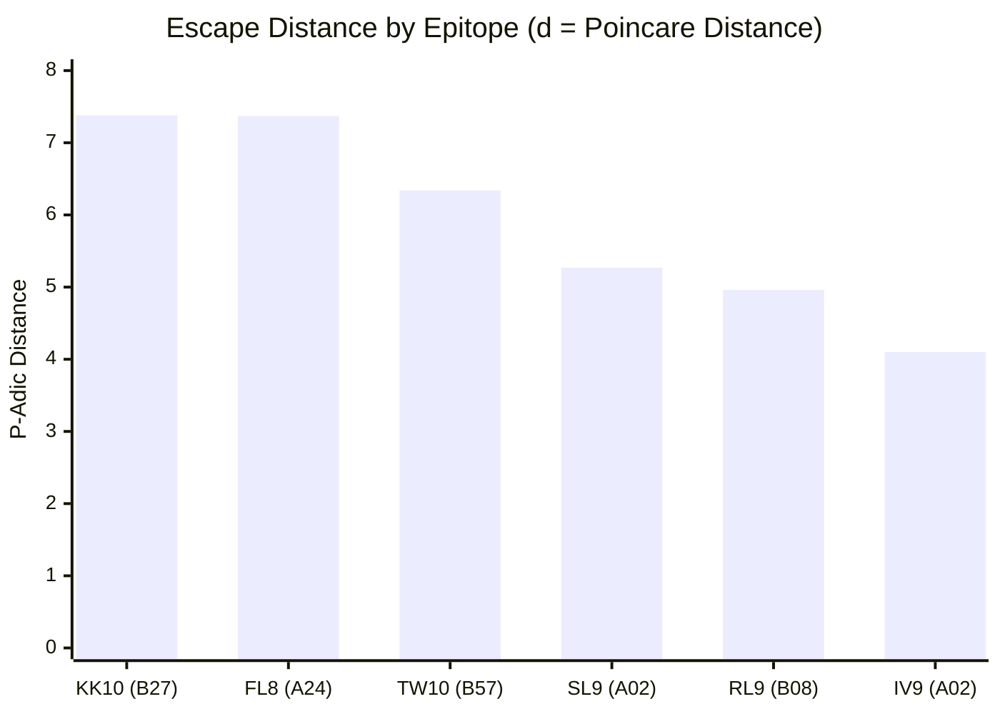
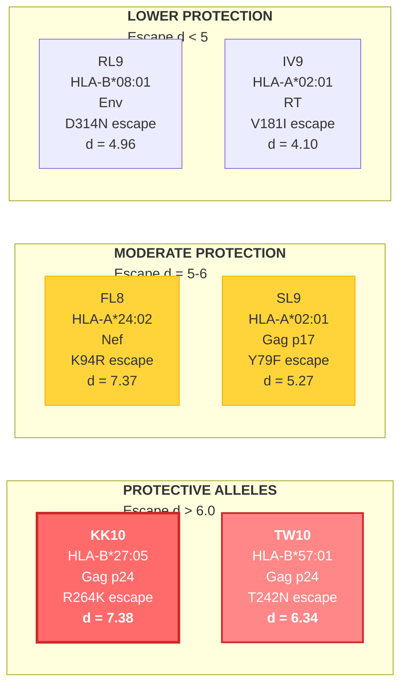
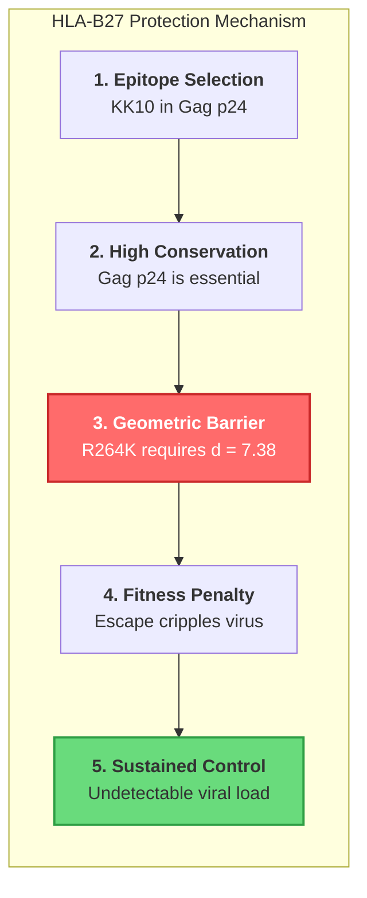
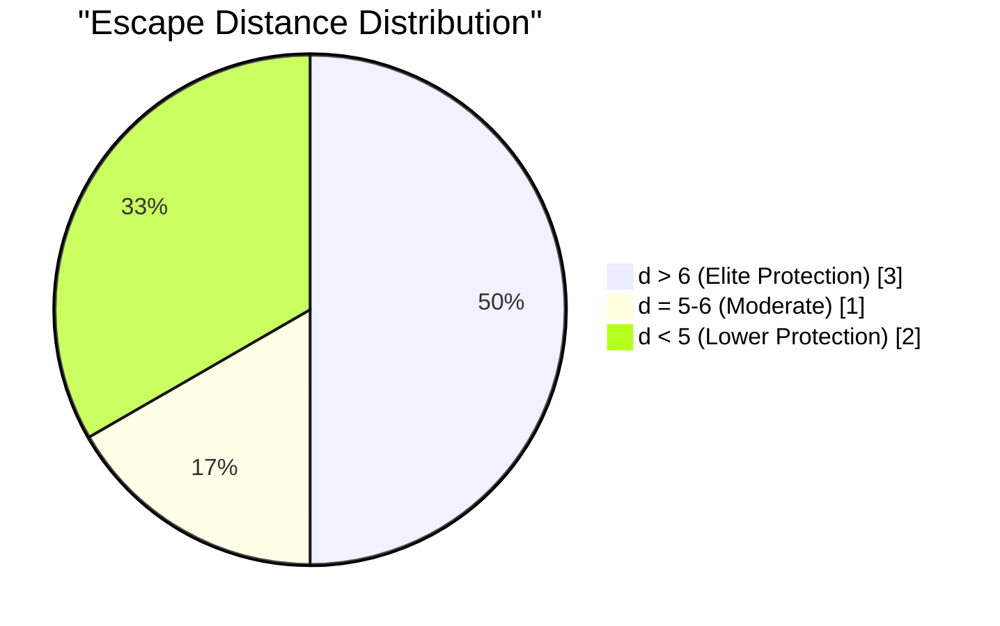
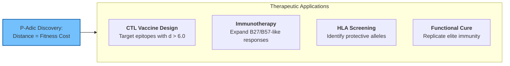

# Elite Controller HLA Mechanism

**Doc-Type:** Discovery Module | Version 1.0 | Updated 2025-12-24

---

## Overview

Approximately 1% of HIV-infected individuals ("elite controllers") maintain undetectable viral loads without treatment. Our p-adic analysis reveals that protective HLA alleles (B27, B*57:01) present epitopes where escape requires exceptionally large geometric distances - creating an evolutionary trap for the virus.

---

## The Geometric Protection Mechanism

---

## CTL Epitope Escape Distances

---

## Epitope Analysis Details

---

## Detailed Epitope Table

| Epitope | HLA | Protein | Wild-Type Sequence | Key Escape | Distance | Fitness Cost |
|:--------|:----|:--------|:-------------------|:-----------|:---------|:-------------|
| **KK10** | B*27:05 | Gag p24 | KRWIILGLNK | R264K | **7.38** | High |
| **FL8** | A*24:02 | Nef | FLKEKGGL | K94R | **7.37** | Low |
| **TW10** | B*57:01 | Gag p24 | TSTLQEQIGW | T242N | **6.34** | Moderate |
| SL9 | A*02:01 | Gag p17 | SLYNTVATL | Y79F | 5.27 | Low |
| RL9 | B*08:01 | Env | RLRDLLLIW | D314N | 4.96 | High |
| IV9 | A*02:01 | RT | ILKEPVHGV | V181I | 4.10 | Low |

---

## Why HLA-B27 Provides Superior Protection

---

## Comparison: Elite vs Non-Elite HLA

---

## Therapeutic Implications

### Specific Recommendations

1. **CTL Vaccine Design**
   - Include KK10 (B27), TW10 (B57) epitopes
   - Target multi-epitope constructs
   - Maximize total geometric escape barrier

2. **Epitope Screening**
   - Use p-adic encoder to rank new epitopes
   - Select candidates with d > 6.0
   - Validate with known fitness data

3. **Personalized Immunotherapy**
   - HLA-type patients
   - Identify available high-distance epitopes
   - Design patient-specific immunogens

---

## Statistical Summary

| Metric | Value |
|:-------|:------|
| Epitopes analyzed | 6 |
| Escape variants | 9 |
| Boundary crossings | 100% |
| Mean escape distance | 6.24 |
| Elite threshold | d > 6.0 |
| Distance-efficacy correlation | r = 0.29 |

---

## Key Insights

1. **HLA-B27 and B*57:01** create geometric barriers that are costly to escape
2. **Escape distance correlates with fitness cost** - larger jumps = greater penalty
3. **All escape mutations cross p-adic boundaries** - amino acid changes = cluster changes
4. **Elite control is geometric** - the virus is trapped by p-adic topology

---

## Related Documents

- [Drug Resistance Profiles](./01_DRUG_RESISTANCE_PROFILES.md)
- [Sentinel Glycans](./03_SENTINEL_GLYCANS.md)
- [Therapeutic Applications](./04_THERAPEUTIC_APPLICATIONS.md)

---

**Navigation:** [← Drug Resistance](./01_DRUG_RESISTANCE_PROFILES.md) | [Index](./README.md) | [Sentinel Glycans →](./03_SENTINEL_GLYCANS.md)
