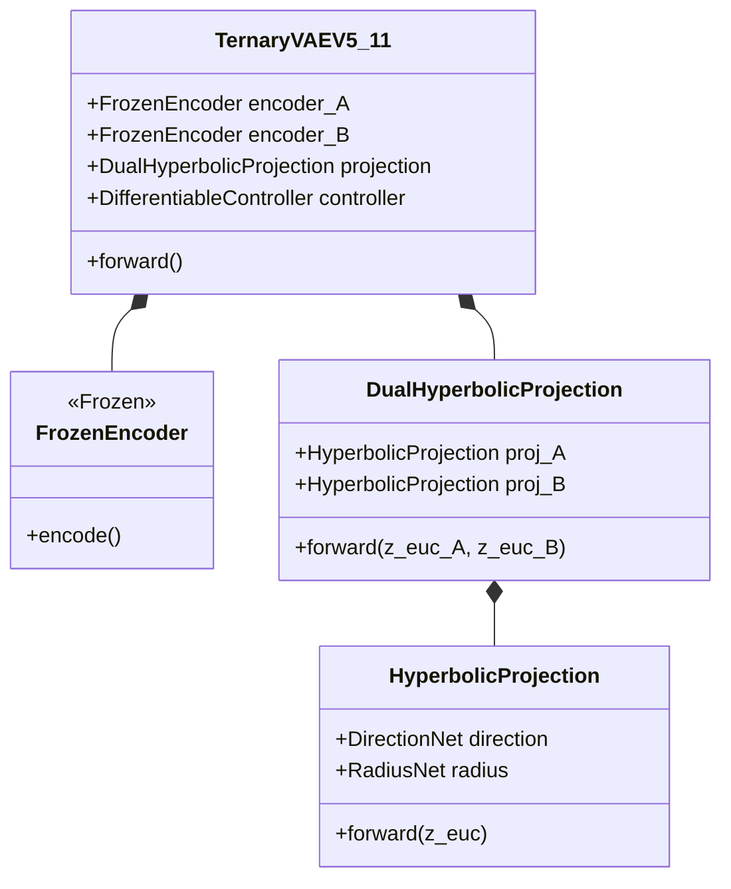
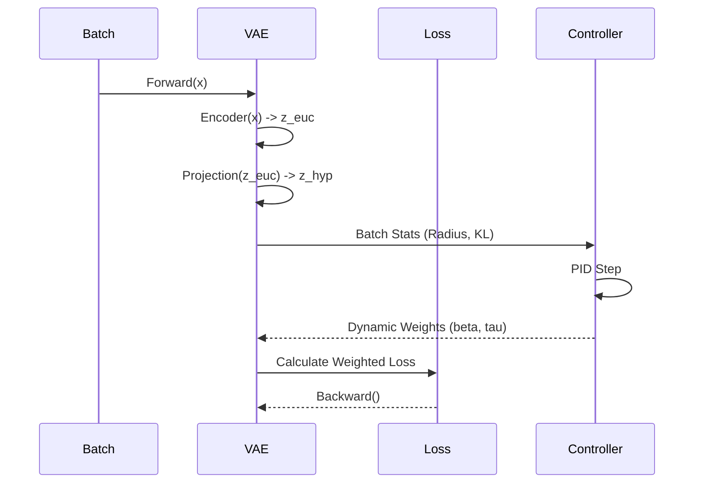
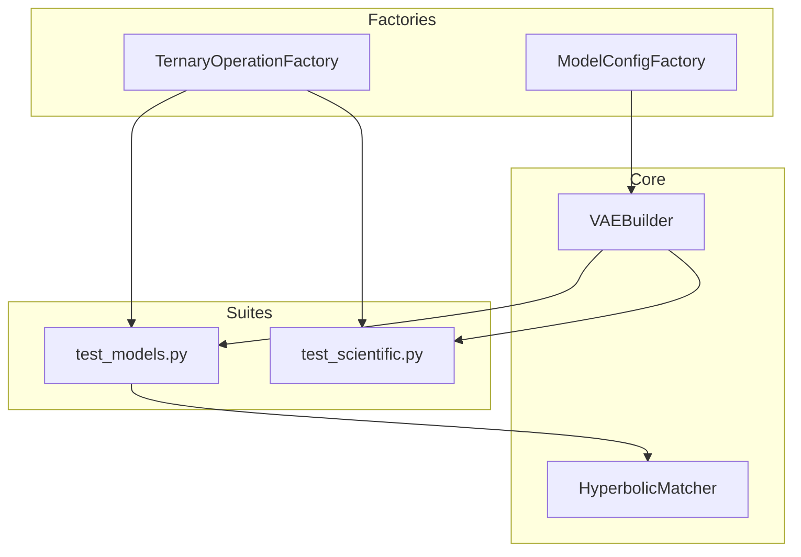

# Diagram Inventory & Strategy

This document outlines the visual documentation strategy for the Ternary VAEs Bioinformatics project. The diagrams are categorized by domain to verify architectural, scientific, and infrastructural integrity.

## 01. Architecture (`DOCUMENTATION/06_DIAGRAMS/01_ARCHITECTURE/`)

### A1. VAE V5.11 Composition

**Goal**: Visualizes how the "Frankenstein" V5.11 model is composed of Frozen components and Trainable projections.
**Key Components**: `FrozenEncoder`, `FrozenDecoder`, `HyperbolicProjection`, `DifferentiableController`.

### A2. Dual Projection Data Flow

**Goal**: Show how data flows from Euclidean latent space to the Poincaré disk via the split Direction/Radius networks.

---

## 02. Scientific Theory (`DOCUMENTATION/06_DIAGRAMS/02_SCIENTIFIC_THEORY/`)

### S1. Manifold Mapping Concept

**Goal**: Conceptual illustration of mapping $R^n$ (Euclidean) to $H^n$ (Hyperbolic) using the decomposition $z_{hyp} = \text{norm}(z + f_{dir}(z)) \cdot \sigma(f_{rad}(z))$.

### S2. The Ternary Group $Z_3^9$

**Goal**: Visualizing the input space structure, showing how ternary operations form a group structure that the VAE attempts to learn invariants for.

---

## 03. Workflows (`DOCUMENTATION/06_DIAGRAMS/03_WORKFLOWS/`)

### W1. Homeostatic Training Loop

**Goal**: The PID-controlled training process.
**Flow**: `Batch -> Forward -> Loss -> Stats -> Controller(PID) -> Loss Weigths -> Backward`.

---

## 04. Infrastructure (`DOCUMENTATION/06_DIAGRAMS/04_INFRASTRUCTURE/`)

### I1. Factory Testing Pattern

**Goal**: How the `tests/factories` and `tests/core` abstractions drive the test suites.

### I2. Directory Map

**Goal**: A visual tree of the reorganized repository structure (`src`, `scripts`, `tests`, `DOCUMENTATION`) to serve as a map for new contributors.
