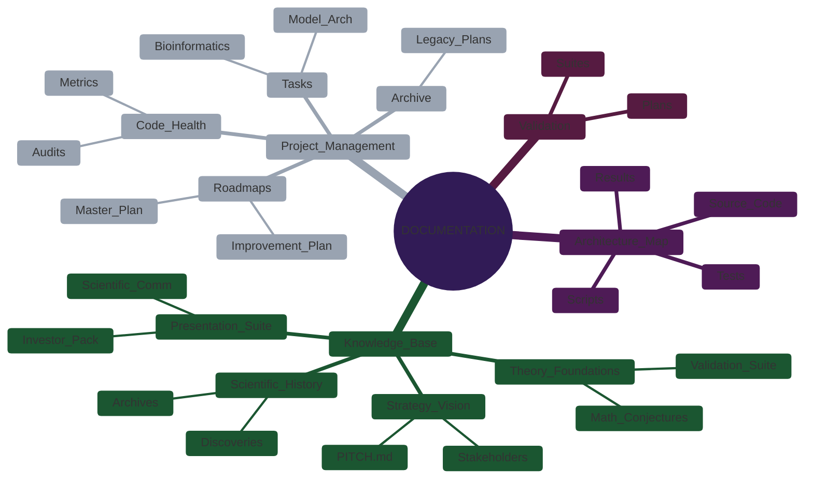

# Documentation Tree Map (Reference)

**Status**: Stable (v4 Structure)
**Last Updated**: 2025-12-24
**Purpose**: Official map of the project's knowledge and management hierarchy.

<!-- embed: DOCUMENTATION/06_DIAGRAMS/05_DOCUMENTATION/documentation_mindmap.mmd -->

%%{init: {'theme': 'base', 'themeVariables': { 'primaryColor': '#673ab7', 'edgeLabelBackground':'#f9f9f9', 'tertiaryColor': '#e1e4e8'}}}%%
mindmap
  root((DOCUMENTATION))
    Knowledge_Base
      Strategy_Vision
        PITCH.md
        Stakeholders
      Presentation_Suite
        Investor_Pack
        Scientific_Comm
      Theory_Foundations
        Math_Conjectures
        Validation_Suite
      Scientific_History
        Archives
        Discoveries
    Project_Management
      Tasks
        Bioinformatics
        Model_Arch
      Roadmaps
        Master_Plan
        Improvement_Plan
      Code_Health
        Audits
        Metrics
      Archive
        Legacy_Plans
    Architecture_Map
      Source_Code
      Scripts
      Tests
      Results
    Validation
      Plans
      Suites
```

---

## 📂 Root: `DOCUMENTATION/`

| File                        | Purpose                                                                                                        |
| :-------------------------- | :------------------------------------------------------------------------------------------------------------- |
| `README.md`                 | **The Entry Point**. Explains the distinction between Knowledge Base (Static) and Project Management (Active). |
| `DOCUMENTATION_TREE_MAP.md` | **The Map**. This file.                                                                                        |

---

## 🧠 Branch 1: `01_PROJECT_KNOWLEDGE_BASE/`

**Philosophy**: "Static Truth". Immutable concepts, standards, and assets.

### `00_STRATEGY_AND_VISION/`

_High-level goals and stakeholder alignment._

| File                       | Type         | Description                      |
| :------------------------- | :----------- | :------------------------------- |
| `PITCH.md`                 | **Asset**    | Executive summary/Pitch script.  |
| `STAKEHOLDER_ANALYSIS.md`  | **Analysis** | User personas (VCs, Biologists). |
| `TAILORED_EXPLANATIONS.md` | **Guide**    | "ELI5" concept explanations.     |

### `01_PRESENTATION_SUITE/`

_Assets for external communication._

| Folder/File                    | Type       | Description                                      |
| :----------------------------- | :--------- | :----------------------------------------------- |
| `PRESENTATION_ASSETS_MAP.md`   | **Index**  | Lookup table for assets.                         |
| `00_COMMON_ASSETS/`            | **Asset**  | Shared logos/diagrams.                           |
| `01_INVESTOR_PACKAGE/`         | **Bundle** | Pitch decks & Market Analysis.                   |
| `02_SCIENTIFIC_COMMUNICATION/` | **Bundle** | **Flattened** domain briefs and theory papers.   |
| &nbsp;&nbsp; ↳ `DOMAIN_*.md`   | **Briefs** | Audience-specific briefs (Virology, Immunology). |
| &nbsp;&nbsp; ↳ `THEORY_*.md`   | **Papers** | Whitepapers and Code Architecture.               |
| &nbsp;&nbsp; ↳ `ASSET_*.md`    | **Tools**  | Grant templates, Design briefs.                  |

### `02_THEORY_AND_FOUNDATIONS/`

_The deep "Why" and Mathematical Standards._

| Folder                   | Description                                          |
| :----------------------- | :--------------------------------------------------- |
| `foundations/`           | Core Math (Ultrametricity, Hyperbolic Geometry).     |
| `metrics_documentation/` | Definitions of "Adelic Capacity", Validation Theory. |
| `validation_suite/`      | Standardized benchmarks.                             |

### `03_EXPERIMENTS_AND_LABS/`

- **Moved**: Active research notebooks are now in `../../research/`. This folder contains summaries only.

### `04_SCIENTIFIC_HISTORY/`

_The Archive of past work._

- `academic_output/`: Old papers.
- `discoveries/`: Log of "Eureka" moments.

### `05_LEGAL_AND_IP/`

- `IP_AND_DEFENSIBILITY.md`: Moat definition.

---

## 🏗️ Branch 2: `02_PROJECT_MANAGEMENT/`

**Philosophy**: "Active Execution". Mutable plans, tasks, and health checks.

### `00_TASKS/`

_Actionable work items (P0-P3)._

| Subfolder                | Descriptions                                |
| :----------------------- | :------------------------------------------ |
| `01_BIOINFORMATICS/`     | `P1_RA_AUTOIMMUNITY`, `P1_VIRAL_EVOLUTION`. |
| `02_MODEL_ARCHITECTURE/` | `P0_GEOMETRY`, `P3_THEORETICAL_VALIDATION`. |
| `03_INFRASTRUCTURE/`     | `P1_SECURITY_FIXES`, `P1_UNIT_TESTING`.     |

### `01_ROADMAPS_AND_PLANS/`

_Strategy execution documents._

| File                                  | Description                           |
| :------------------------------------ | :------------------------------------ |
| `00_MASTER_ROADMAP_JONA.md`           | The 2025 Vision (Q1-Q4).              |
| `IMPROVEMENT_PLAN.md`                 | Tech Debt remediation.                |
| `VALIDATION_AND_BENCHMARKING_PLAN.md` | **[MASTER]** Execution of validation. |

### `02_CODE_HEALTH_METRICS/`

_Reports and automated audits._

| File                      | Description                       |
| :------------------------ | :-------------------------------- |
| `SUMMARY_CODE_HEALTH.md`  | High-level status & action items. |
| `_raw_data/`              | Raw linting logs (Hidden).        |
| `TECHNICAL_DEBT_AUDIT.md` | Semantic analysis of debt.        |

### `03_ARCHIVE/`

_Deprecated plans._

---

## 💻 Branch 3: Codebase Map

**Philosophy**: "Executable Truth". The implementation of the theory.

| Directory  | Purpose                                                |
| :--------- | :----------------------------------------------------- |
| `src/`     | **Core Library**. The reusable `ternary_vae` package.  |
| `scripts/` | **Labs**. Experiments and analysis scripts.            |
| `results/` | **Evidence**. Generated artifacts (Checkpoints, Logs). |
| `tests/`   | **Guardrails**. Unit and Integration tests.            |

---

## 🔬 Branch 4: Validation (New)

| Folder                     | Purpose                                    |
| :------------------------- | :----------------------------------------- |
| `05_VALIDATION/01_PLANS/`  | **Strategy**. Master Plan, CI/CD.          |
| `05_VALIDATION/02_SUITES/` | **Design**. Test cases (Unit, Scientific). |
