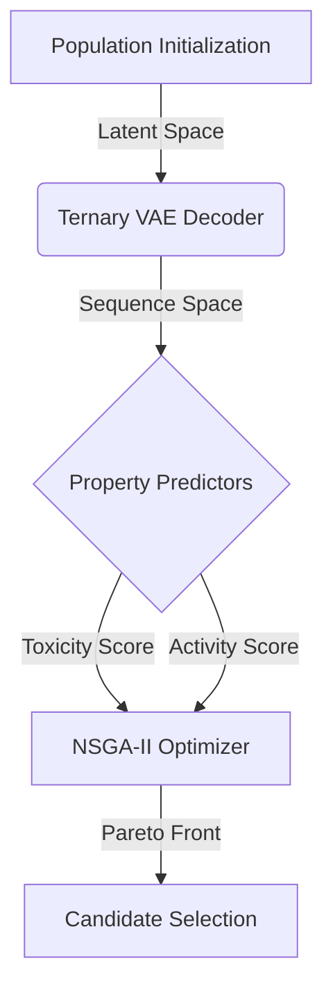

# Project Alpha: The Peptide Foundry

**Technical Deep Dive | Lead: Dr. Carlos Brizuela**

---

## 1. System Architecture

## 2. The Core Innovation: Latent Space Optimization

Traditional Directed Evolution mutates discrete amino acids (combinatorial explosion). We optimize in the **Continuous Latent Space**.

### The Math

- **Object:** 16-Dimensional Hyper-Torus (Phase Space).
- **Optimizer:** NSGA-II (Non-dominated Sorting Genetic Algorithm II).
- **Constraints:**
  - `Z_dim = 16`
  - `Bounds = [-3, 3]` (Standard Normal Prior)

## 3. Implementation Details

### A. VAE Interface (`src.vae_interface`)

- **Model:** PyTorch Module (`TernaryVAE`).
- **Decoder:** Maps `size=(B, 16)` $\rightarrow$ `size=(B, L, 20)` Logits.
- **Constraint Handling:** Checks validity of generated ternary codons.

### B. Objectives (`src.objectives`)

1.  **Reconstruction Loss:** Ensures the peptide "makes sense" (is chemically valid).
2.  **Toxicity (`ToxinPred2`):** Regressor predicting Hemolytic Activity ($HC_{50}$).
3.  **Activity (`AMPScanner`):** Classifier probability of Antimicrobial action.

## 4. Key Challenges & Solutions

- **Challenge:** Latent Space "Holes" (invalid regions).
  - _Solution:_ Epistemic Uncertainty Quantification (Ensemble Decoding).
- **Challenge:** Mode Collapse (generating the same peptide).
  - _Solution:_ "Phylogenetic Crowding" metric in NSGA-II.

## 5. Next Specifications

To actuate this:

1.  Load `checkpoints/ternary_vae.pt`.
2.  Wrap `ToxinPred2` command line tool in Python.
3.  Run `src/scripts/latent_nsga2.py --generations 500`.
