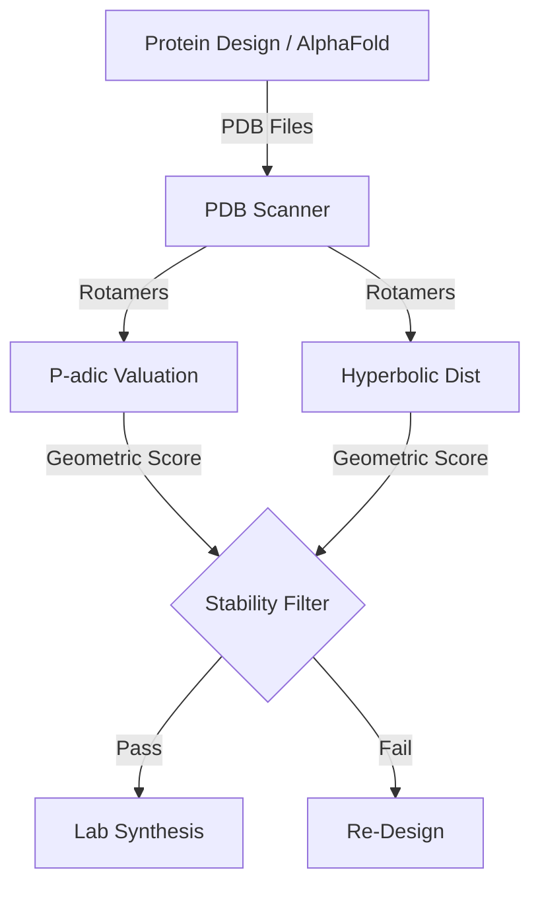

# Project Gamma: Geometric QC

**Technical Deep Dive | Lead: Dr. José Colbes**

---

## 1. System Architecture

## 2. The Core Innovation: P-adic Stability

Standard energy functions (Rosetta) miss "kinetically trapped" stats. We use algebraic number theory to find them.

### The Math

- **Valuation:** 3-adic valuation $v_3(x)$ measures "depth" in the hierarchical tree of conformations.
- **Hyperbolic Distance:** Measures deviation from the "Ideal Geometric Center" of the rotamer cluster.

## 3. Implementation Details

### A. PDB Scanner (`src.pdb_scanner`)

- **Input:** Directory of `.pdb` files (e.g., `af2_results/`).
- **Parsing:** Extracts $\chi_1, \chi_2, \chi_3, \chi_4$ angles.

### B. Scoring Engine (`src.scoring`)

- **Formula:**
  $$ S = \frac{1}{1 + d\_{hyp}} + \lambda \cdot v_p(\chi) $$
- **Threshold:** $S < 0.8$ $\rightarrow$ "Unstable / Rare".

## 4. Key Challenges & Solutions

- **Challenge:** P-adic numbers are non-archimedean (hard to combine with Euclidean energy).
  - _Solution:_ We use the _valuation_ (an integer) as a penalty term in a standard loss function.
- **Challenge:** Rotamer library dependency.
  - _Solution:_ We embed the _entire_ Dunbrack library into the p-adic tree as the reference frame.

## 5. Next Specifications

To actuate this:

1.  Point `PDBScanner` to a folder of AlphaFold predictions.
2.  Run `scripts/rotamer_stability.py` to filter the bad designs before ordering DNA.
